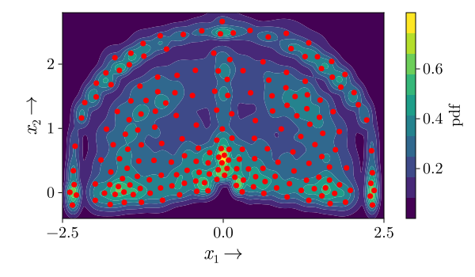
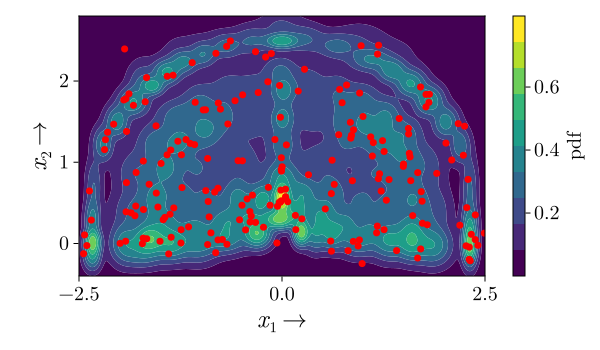

# PCDSampling.jl

`PCDSampling.jl` is a Julia package for drawing deterministic samples from multivariate probability distributions using Projected Cumulative Distributions (PCDs).

It accompanies the paper:

**Fast Deterministic Sampling of Gaussian Mixture Densities using Projected Cumulative Distributions**

The package provides CPU and GPU implementations for deterministic sampling from Gaussian mixture densities.

| Deterministic samples                                       | Random samples                                |
| ----------------------------------------------------------- | --------------------------------------------- |
|  |  |

Deterministic samples are designed to cover the target density more evenly than random samples with the same sample size.

## Quick Start

Clone the repository and start Julia from the repository root:

```bash
git clone https://github.com/KIT-ISAS/PCDSampling.jl
cd PCDSampling.jl
julia
```

Activate the project environment:

```julia
using Pkg
Pkg.activate(".")
Pkg.instantiate()
Pkg.precompile()
```

Load the package and run an example:

```julia
using PCDSampling

include("scripts/examples.jl")

sample_gaussian(N=500, P=100, L=-1, use_local=false)
```

## Documentation

More detailed instructions are available here:

- [Installation and environment setup](docs/installation.md)
- [Running examples](docs/examples.md)
- [Reproducing paper results](docs/reproducing_paper_results.md)
- [Usage guide](docs/usage.md)

## Repository Structure

```text
.
├── src/          Main CPU implementation
├── ext/          CUDA extension for GPU sampling
├── scripts/      CPU and GPU examples
├── benchmark/    Benchmark scripts
├── test/         Package tests
└── docs/         Additional documentation
```

## Python Implementation

A Python implementation of PCD-based sampling is available at:

https://github.com/KIT-ISAS/PCD_sampling_py

## Citation

If you use this repository in your work, please cite:

```bibtex
@inproceedings{FUSION26_Prossel,
 address = {Trondheim, Norway},
 author = {Dominik Prossel and Zhilun Li and Petr Novikov and Uwe D. Hanebeck},
 booktitle = {Proceedings of the 29th International Conference on Information Fusion (FUSION 2026)},
 month = {June},
 title = {Fast Deterministic Sampling of Gaussian Mixture Densities using Projected Cumulative Distributions},
 year = {2026}
}
```

## Licence

MIT - use these skills in your projects, teams, and tools.